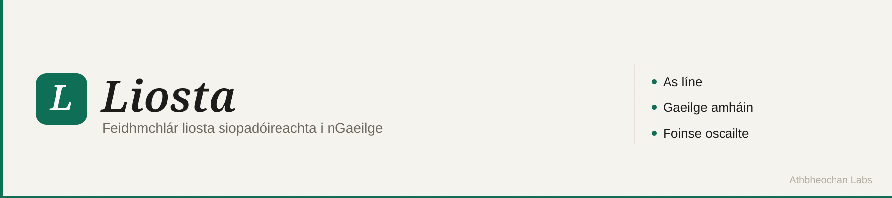

# Liosta



Liosta is a small offline-first list app in Irish. It supports multiple lists, item counts, checked items, local persistence, PWA install, and Android packaging through Capacitor.

## Cad e Liosta?

Liosta is for quick everyday lists: shopping, tasks, notes, or anything that benefits from a simple checked/unchecked flow. Data is stored locally in the browser with `localStorage`, so the app keeps working offline after the shell has been cached.

## Suiteail

Install dependencies:

```sh
npm install
```

Start the development server:

```sh
npm run dev
```

Run type and Svelte checks:

```sh
npm run check
```

## Togail

Build the web app:

```sh
npm run build
```

Preview the production build:

```sh
npm run preview
```

Build and sync the Android project:

```sh
npm run build
npx cap sync android
```

Open Android Studio:

```sh
npx cap open android
```

Build an Android debug APK from the command line:

```sh
./android/gradlew -p android :app:assembleDebug
```

## Foilsiu

AWS Amplify Hosting uses the repo-level [`amplify.yml`](./amplify.yml) file:

- Build command: `npm run build`
- Output directory: `build`
- Install command: `npm ci`

In Amplify, connect the `athbheochan-labs/liosta` repository and add the custom domain `liosta.athbheochan.irish`. If the domain is managed in Route 53, Amplify can create the required DNS records automatically.

Add this rewrite rule in Amplify Hosting so direct page loads fall back to the static SvelteKit app shell:

| Source address | Target address | Type |
| --- | --- | --- |
| `</^[^.]+$|\.(?!(css|gif|ico|jpg|js|png|svg|txt|webmanifest|woff|woff2)$)([^.]+$)/>` | `/index.html` | `200 (Rewrite)` |

After deployment, verify:

- `https://liosta.athbheochan.irish/manifest.webmanifest` returns HTTP 200.
- `https://liosta.athbheochan.irish/sw.js` returns HTTP 200 with JavaScript content.
- The app is served over HTTPS and can be installed as a PWA.

## Ceadunas

MIT. See [LICENSE](./LICENSE).
